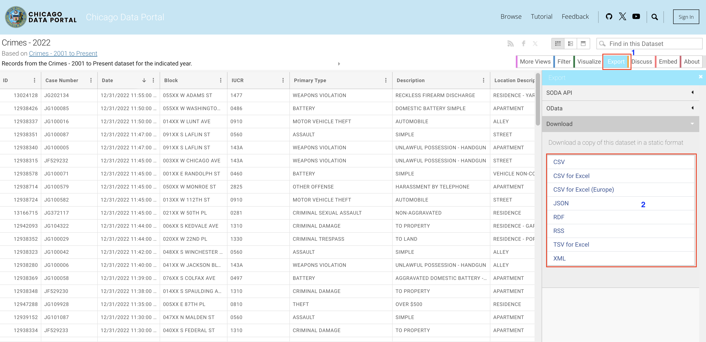

# Chicago Crime Analysis
Like any other major city, criminal activities can be rampant due to overpopulation, unemployment, poverty and other factors. Since 2001, the [Chicago police department](https://data.cityofchicago.org/) has made available crime data showing hot spots locations in Chicago and prevailing crimes in the city. This project is an attempt to understand the scope of crimes in Chicago using the same data and extract useful insights to be used and exemplified by police in other countries.

## Table of Content
### 1. Data
### 2. Geographical Analysis (Google Maps)
### 3. Excel Summary Statistics
### 4. 3D visualisation using Kepler.gl
### 5. Insights
### 6. Conclusion

## Data
The analysis covers crimes in Chicago from the year 2001 and 2023. The data is first downloaded from the Chicago Data Portal, an open data portal of the city of Chicago that allows you to find city data. 

To download the data, visit the [portal](https://data.cityofchicago.org/Public-Safety/Crimes-2022/9hwr-2zxp/data) and export the data. To download the data, click export1 -> format of file needed2.

<!-- The top five entries in Excel: -->

## Geographical Analysis (Google Maps)
Using [Google MyMaps](https://www.google.com/mymaps), summary visulisation maps will be reproduced to help understand the overall distribution of crimes in chicago by:
1. The Blocks
2. Type of Crime
3. Local Description
4. Arrest and Domestic cases
5. Disrict, Ward and Community area

### Crimes By Blocks
Visualisation of crimes in each block/street in Chicago:

### Type of Crimes
Map visualisation of types of crime in Chicago:

### Arrest and Domestic cases
Police action to crime incidents and home violence mapping.

### Geospatial Analysis using admin shapfiles
The use of administrative boundaries help define the hotspots in Chicago in the following categories:
#### 1. Disricts:

#### 2. Ward:

#### 3. Community areas:

## Excel Summary Statistics
Using Pivot tables summaries Chicago crimes is analysed using both Descriptive and Inferential statistics.

### Distribution of crimes since 2001:

### Crime per District

### Crimes per Ward for highest District

### Disribution of Arrests

#### Arrests by Crime Type

#### Arrests by Domestic/Non-Domestic Crimes

#### Community areas with the highest crimes

#### Location of Crimes

## 3D visualisation using Kepler.gl
Hexagonal map showing the Hotspots in Chicago

## Insights
xxxxxx

## Conclusion
xxxxxxx

